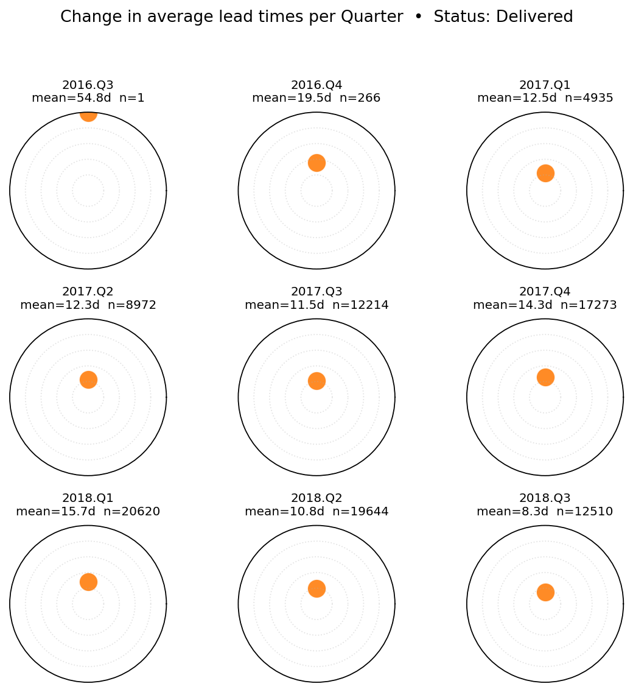
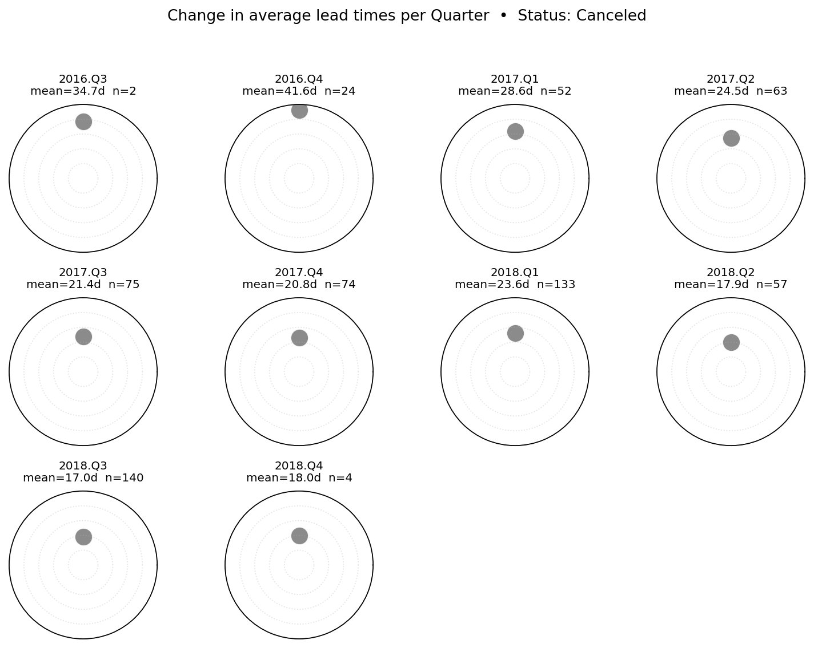
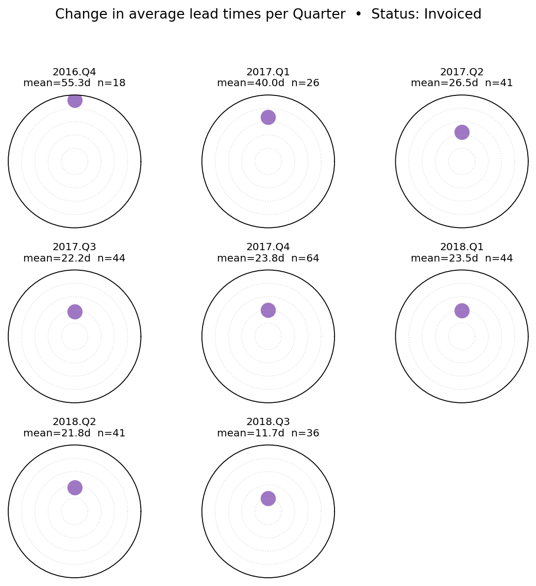
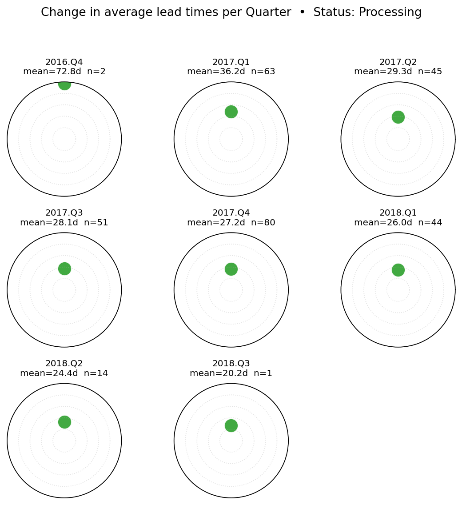
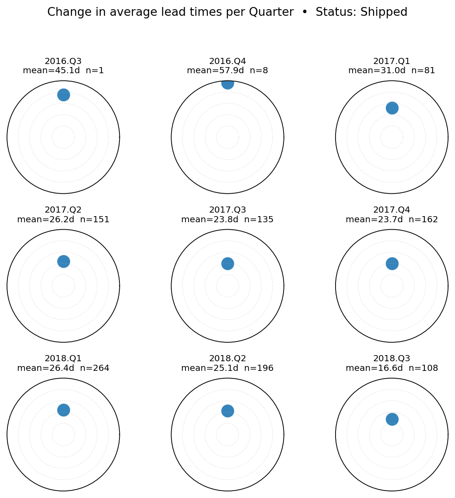
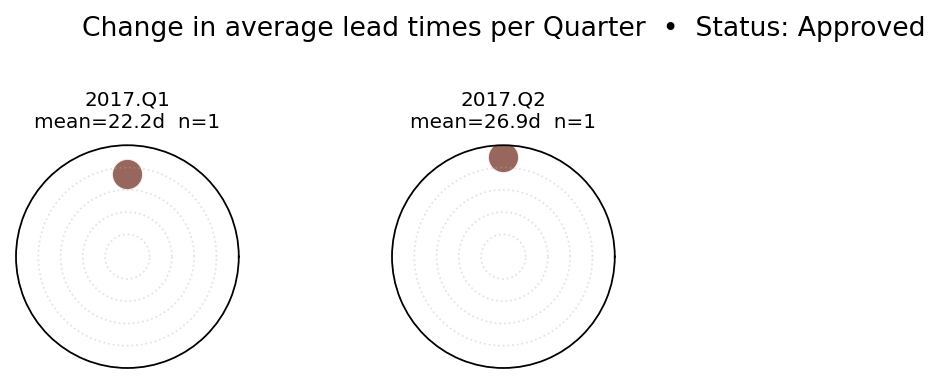
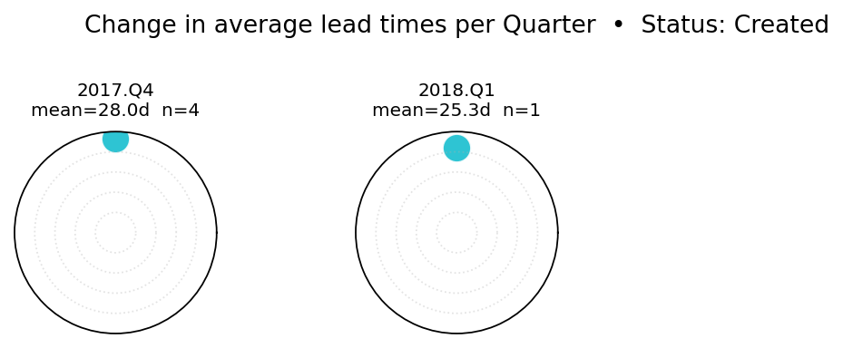
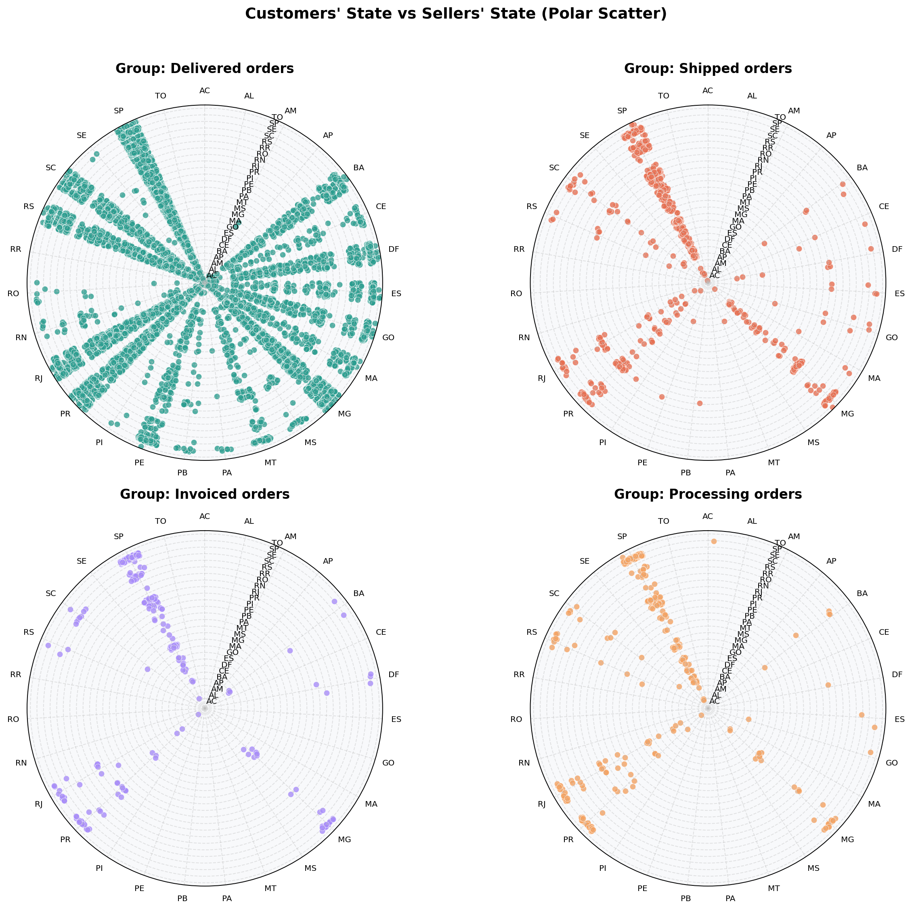

# Olist Freight & Order Cycle — Analytics (Supply-Chain Report)

> **Challenge Brief:** Explain what drives **Freight Value (shipping cost) per order**, how the **order cycle** changes over time, and how **customers vs. sellers** are distributed geographically — while accounting for different **order types**.

---

## 1) Executive Summary

-What drives freight?
The primary continuous driver is product weight (kg). On the merged Olist dataset, a Quasi-Poisson GLM indicates +5.3% freight per +1 kg (log-link coefficients converted to % per unit). Distance (km) also raises cost (e.g., +~4% per +100 km), while more items per order tends to reduce freight per order (economies of scale, e.g., **−2% per extra item**).

- **Order-cycle trend:**  
  Quarter-by-status “mini” charts show **steady improvement** in lead times for **Delivered** and **Invoiced** statuses; **Canceled** orders exhibit higher lead times (consistent with service-level risk) but also improve over time.

- **Segmentation for action:**  
  We split orders into **6 clusters** (k-means) on business features (lead time, items/order, price, freight, weight). This balances the portfolio and enables **cluster-specific playbooks** (e.g., weight-heavy cluster → packaging reduction; distance-heavy cluster → zone/linehaul strategy).

- **Business deliverable:**  
  A polished Excel & CSV pack: interpretable drivers (converted to multipliers), cluster quarterly tables, and fast-moving category buckets to align with the original Kaggle narrative.

---

## 2) Business Context & Questions

1. **Freight cost drivers:** Which product and flow characteristics (weight, distance, volume, items/order, price) most explain freight per order?  
2. **Order cycle:** How have lead times moved as Olist scaled (by quarter and order status)?  
3. **Portfolio & targeting:** Which **clusters** of orders/customers/sellers behave similarly, and what operational levers should we pull for each?  
4. **Demand velocity:** Which **product categories** are “fast moving” month-by-month (six frequency buckets), to prioritize inventory and carrier capacity?

---

## 3) Data & Preparation
  -** original dataset:**  https://www.kaggle.com/code/anshumoudgil/olist-ecommerce-analytics-quasi-poisson-poly-regs#stimulation-as-customers-product-categories-sellers
- **Data scope:** Olist public datasets (2016–2018), ~**112k item-level rows** after joins.
- **Key joins:** Orders ⇄ Items ⇄ Products ⇄ Customers ⇄ Sellers (+ translations).  
- **Feature engineering:**  
  - **Lead times:** approval minutes; actual delivery lead time (days).  
  - **Price & freight per item**; **items per order**.  
  - **Distance (km)** between seller and customer; **product weight (kg)** and **volume (cm³)**.  
  - **Time:** purchase month, quarter, year; **order status** (Approved, Created, Processing, Invoiced, Delivered, Canceled).  
  - **Clusters:** 6 groups via **k-means** (customer- or seller-centric, depending on file).  
- **Target:** `freight_value` (per item/order, depending on table).

> Files to open:
>
> - `outputs/excel/Olist_Freight_OrderCycle_Report.xlsx`  
> - `outputs/tables/glm_quasipoisson_coeffs_per_cluster.csv`  
> - `outputs/tables/qp_continuous_effects.csv`  
> - `outputs/tables/qp_categorical_multipliers.csv`  
> - `outputs/tables/cluster_*_summary.csv` (six tables)  
> - `outputs/tables/fast_moving_*.csv` (six buckets)

---

## 4) Modelling Approach (Explainable + Accurate)

### 4.1 Baselines & accuracy models
We established a lightweight performance baseline and a stronger non-linear model:

| Model | Purpose | Example Test Metrics |
|---|---|---|
| Linear Regression | quick baseline | MAE ≈ **5.07**, RMSE ≈ **8.54** |
| Polynomial (deg=2) | simple non-linearity | MAE ≈ **6.61**, RMSE ≈ **11.71** (overfits/underperforms) |
| **HistGradientBoostingRegressor** | accuracy benchmark | **MAE ≈ 4.24, RMSE ≈ 7.69** |

> We keep the ensemble (HGBR) for **prediction quality**, but it’s a **black-box** for operations.

### 4.2 Quasi-Poisson GLM (interpretability)
For explainability and inference we used **GLM with Poisson family** and **robust (HC0) standard errors** to handle **over-dispersion**.  
Formally:
\[
\log(\mathbb{E}[\text{Freight}]) = \beta_0 + \sum_j \beta_j X_j
\]
- Continuous features → convert \(\beta\) to **% per unit**: \( \% \approx (e^{\beta}-1)\times 100 \)  
- Categorical features → **multipliers vs baseline**: level effect = \(e^{\beta}\)

We fit **two forms per cluster**:
- **Simple:** `freight_value ~ items_per_order` (to match Kaggle’s item-centric interpretation)
- **Extended:** `freight_value ~ items_per_order + price + lead_time_days + approval_mins + distance_km + product_weight_kg + product_volume_cm3 + C(product_category_name_english) + C(order_status)`

---

## 5) Results & Interpretation

### 5.1 Continuous drivers (overall example)
From `qp_continuous_effects.csv` (numbers vary by cluster):

- **Weight (kg):** \(\beta \approx 0.0514 \Rightarrow e^{0.0514}-1 \approx +5.28\%\) per +1 kg  
- **Items per order:** \(\beta \approx -0.0206 \Rightarrow -2.0\%\) per extra item  
- **Distance (km):** small per-km slope; aggregated it reads **~+4% per +100 km**  
- **Lead time (days):** mild positive elasticity (operational friction)  
- **Approval (mins)** and **Volume (cm³):** low elasticities in this dataset (context-dependent)

> **Operational reading:** lower weight and increase items/order (bundling/packs) → immediate freight reduction; optimize linehaul/zones to reduce effective kilometers for distance-heavy flows.

### 5.2 Categorical multipliers (vs baseline)
From `qp_categorical_multipliers.csv`: product categories show **effects × baseline** (e.g., **computers** ×1.52).  
Use this to **price freight** or set **service SLAs** per family.

### 5.3 Order-cycle evolution (lead-time minis)
Embed the images in README:

<p align="center">
  
  
  
</p>

- **Delivered:** steady improvement quarter-over-quarter.  
- **Canceled:** longer lead times (risk signal), improving later.  
- **Invoiced / Processing:** consistent downward trend (WIP stabilizing).  
- **Approved / Created:** low volume (noisy; kept for completeness).

### 5.4 Six clusters = six quarterly tables
`cluster_0_summary.csv` … `cluster_5_summary.csv` summarize **median per quarter** of:
- **Actual lead time (days)**
- **Approval minutes**
- **Items per order**
- **Price, Freight, Weight**

This mirrors Kaggle’s six tables and lets ops leaders compare **like with like**.

---

## 6) Fast-Moving Categories (six frequency buckets)

We classify (Month × Category) into six **velocity buckets** (as in the Kaggle write-up):

1. **One order**  
2. **1 < n < 6**  
3. **5 < n < 21**  
4. **20 < n < 93**  
5. **92 < n < 251**  
6. **n > 250**

Outputs are in `outputs/tables/fast_moving_*.csv`.  
**Use:** candidate lists for **inventory SLAs**, **promotion windows**, and **capacity reservations** with carriers.

---

## 7) What a Supply-Chain Pro Would Do (Actions & Playbooks)

- **Weight-heavy clusters:** packaging redesign (−100–250 g typical → **−0.5% to −1.3%** freight/order), cartonization rules, enforce dimensional weight controls.  
- **Distance-heavy clusters:** regional injection, alternative linehaul, renegotiate carrier **zone breaks**; shift long lanes to multi-stop milk runs.  
- **Low items/order with negative elasticity:** bundle SKUs, “buy-more-save-shipping”, cart add-on nudges → lift to 2–3 items.  
- **Long approval → long delivery:** SLA with fraud/OMS teams; threshold-based auto-approval for low-risk baskets.  
- **Category multipliers:** align freight pricing & promised SLAs by family; avoid under-recovering on bulky categories.  
- **Fast-moving months:** pre-position inventory with priority carriers; book capacity early.

---

## 8) Obstacles We Hit (and How We Solved Them)

- **String dtype error in statsmodels (`string[python]`):** cast categoricals to `category` before GLM.  
- **Singular matrix / perfect collinearity:** dropped constant/duplicate/near-duplicate columns; if needed, used **regularized GLM** fallback.  
- **Over-dispersion:** used **Poisson mean + robust SE (HC0)** → **Quasi-Poisson** behavior.  
- **Timeouts in polynomial/large grids:** limited polynomial degrees; used HGBR for accuracy without extreme tuning.  
- **Missing clusters in some files:** generated 6-group **k-means** on standardized business features and saved back.  
- **Sparse statuses (Approved/Created):** kept for completeness, but flagged as low-confidence.  
- **Geography joins:** ensured consistent ZIP/lat-lng cleaning before distance calc.

---

## 9) Limitations & Guardrails

- Effects are **dataset-specific** (2016–2018). Re-fit for new carriers, zones, or product mix.  
- GLM coefficients assume a **log-linear** elasticity; extreme weights/distances may deviate.  
- Categorical multipliers require stable **baseline** and sufficient sample per level.

---

## 10) How to Use the Repo

- Open the **Excel report** for stakeholder-ready tables:  
  `outputs/excel/Olist_Freight_OrderCycle_Report.xlsx`
- Deep-dive CSVs in `outputs/tables/`:  
  - `qp_continuous_effects.csv` (weight/distance/items elasticities)  
  - `qp_categorical_multipliers.csv` (category multipliers vs baseline)  
  - `glm_quasipoisson_coeffs_per_cluster.csv` (coeffs & p-values per cluster)  
  - `cluster_*_summary.csv` (six quarterly tables)  
  - `fast_moving_*.csv` (six velocity buckets)
- Figures in `images/` (update paths if you store them elsewhere).

---

## 11) Reproducibility 

```bash
pip install -r requirements.txt
# Rebuild key outputs (if scripts are included in /src)
# python src/glm_per_cluster.py
# python src/build_fast_moving.py
# python src/make_excel_report.py


## 📊 Lead-time minis (Quarter × Status)

<p align="center"><b>Status: Delivered</b></p>
<p align="center">
  
</p>

<p align="center"><b>Status: Canceled</b></p>
<p align="center">
  
</p>

<p align="center"><b>Status: Invoiced</b></p>
<p align="center">
  
</p>

<p align="center"><b>Status: Processing</b></p>
<p align="center">
  
</p>

<p align="center"><b>Status: Shipped</b></p>
<p align="center">
  
</p>

<p align="center"><b>Status: Approved</b> • <b>Status: Created</b></p>
<p align="center">
  
  
</p>

## 🗺️ Sellers vs Customers (states)
<p align="center">
  
</p>


